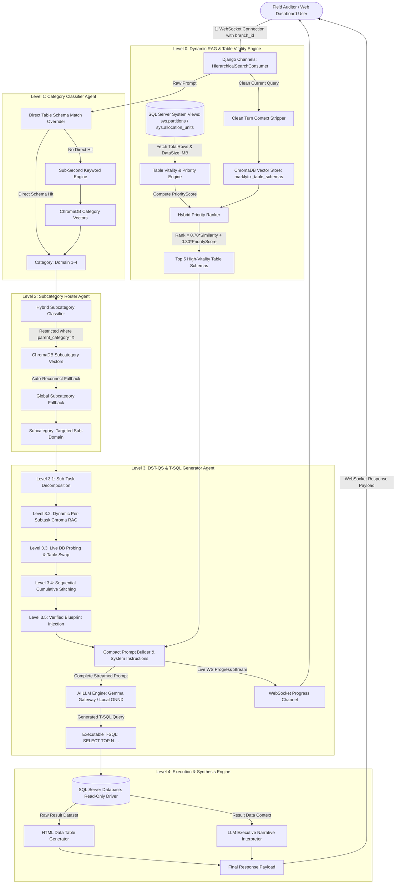

# Technical Architecture Specification: Sonata Satark Marklytix Chatbot
## Comprehensive 5-Level Hierarchical Multi-Agent Engine, Priority RAG & System Protocols

---

## 1. Executive Architecture Overview

The **Sonata Satark Marklytix AI Chatbot** is an enterprise-grade natural language intelligence system that translates complex natural-language business and field audit questions into optimized MS SQL Server T-SQL queries in real time.

Built upon a **5-Level Multi-Agent Architecture**, the engine integrates:
1. **Turn-Isolated Vector Schema RAG** (ChromaDB HNSW persistent vector store).
2. **Decomposed Sub-Task Query Synthesizer (DST-QS)** with Dynamic Per-Subtask Chroma RAG & Live DB Probing.
3. **Sequential Cumulative Stitching Engine** utilizing NetworkX Knowledge Graph (`MarklytixRelationalGraph`).
4. **SQL Server Production Vitality Statistics** (`sys.partitions`, `sys.allocation_units`).
5. **Automated Table Priority & Vitality Scoring Engine** ($PriorityScore \in [0.01, 1.00]$).
6. **Customer Referral & Ultra-Strict 2-Layer Intent Audit Engine** (`loan_opportunity`).
7. **Session-Level Branch Scoping (`branch_id`)** & Read-Only ODBC Execution Safety.

---

## 2. Detailed Level-by-Level Execution Flow

### Level 0: Dynamic RAG & Table Vitality Priority Scoring Engine
- **Purpose**: Retrieves top $K=5$ dynamic database table schemas with highest production relevance.
- **Turn Context Stripping**: Multi-turn history is kept for LLM dialogue, but stripped away before calling ChromaDB vector search (`clean_query = message.split("Current question:")[-1]`). This prevents previous questions from polluting schema selection.
- **Vitality Statistics Extractor**: Queries `TotalRows` and `DataSize_MB` for each table from SQL Server `sys.partitions` and `sys.allocation_units`.
- **Logarithmic Volume Formula**: $S_{volume} = \min(1.0, \log_{10}(\text{TotalRows} + 1) / 5.0)$.
- **Penalty Engine**: Applies `-0.60` penalty for backup tables (`_bkp`, `backup`, `_19june`, `_8june`), `-0.70` penalty for empty temp tables (`tempUsers`), and `+0.15` bonus for primary master tables (`accounts_`, `mst_`, `audit_`).
- **Hybrid Priority Ranker**: Calculates $\text{Rank} = 0.70 \cdot \text{Vector Similarity} + 0.30 \cdot \text{PriorityScore}$ to sort candidate schemas.

### Level 1: Category Classification Agent
- **Purpose**: Classifies user prompt into 1 of 4 operational macro domains:
  1. `domain 1: user interaction, session management & security auditing`
  2. `domain 2: financial risk modeling & branch performance`
  3. `domain 3: audit, compliance & performance measurement`
  4. `domain 4: loan disbursal & call analysis`
- **Direct Table Schema Overrider**: If the user prompt mentions exact table or column names (e.g. `audit_branch_checklist_feedback`), bypasses category misclassification and routes directly with 0.73+ confidence.
- **Vector Distance Matching**: Queries `marklytix_categories` collection in ChromaDB.

### Level 2: Subcategory Router Agent
- **Purpose**: Routes query into specific operational subcategories (e.g., `PAR & DPD Analysis`, `Vault Logs`, `Checklist Scoring & Summaries`).
- **Restricted Search**: Queries `marklytix_subcategories` with `where={"parent_category": category}` filter.
- **Auto-Reconnect Guard**: Automatically reloads stale ChromaDB collection handles if database re-indexing occurred while Django was running.

### Level 3: Decomposed Sub-Task Query Synthesizer (DST-QS) & T-SQL Generator
- **Level 3.1: Sub-Task Decomposition**: Decomposes multi-goal natural language queries into sub-tasks (User Entity, Role Attribute, Branch Location, Audit Metrics).
- **Level 3.2: Dynamic Per-Subtask Chroma RAG**: Dynamically queries ChromaDB vector store (`marklytix_table_schemas`) for domain candidates specific to each sub-task description (zero hardcoding!).
- **Level 3.3: Live DB Probing & Table Swap Routing**: Tests candidates with `SELECT TOP 1 WITH (NOLOCK)` queries on SQL Server with system table blacklist filtering (`django_migrations`, `sysdiagrams`, `authtoken_token`).
- **Level 3.4: Sequential Cumulative Stitching**: Sequentially passes working queries across tasks, discovers relational join keys via `MarklytixRelationalGraph`, tests 2-table/3-table joins live on SQL Server, and verifies non-NULL row returns.
- **Level 3.5: Verified Blueprint Injection**: Injects the pre-tested multi-table T-SQL blueprint under `⚡ [DST-QS VERIFIED SUB-TASK BLUEPRINT QUERY]:` directly into the LLM prompt right above `USER QUERY:`.

### Level 4: Execution & Synthesis Engine
- **Purpose**: Executes query against SQL Server and formats response.
- **Read-Only Driver**: Connects via SQLAlchemy / pyodbc. Enforces `SELECT`-only statements.
- **Multi-Tier Fallbacks**: Falls back to raw pyodbc connection if SQLAlchemy connection pools time out.
- **HTML Table & Executive Briefing**: Formats raw dataset into styled HTML table and synthesizes 3-5 sentence narrative briefing.

---

## 3. Customer Referral & 2-Layer Intent Audit System (`loan_opportunity`)

### Pipeline Workflow:
1. **Audio Download & Smart Slicing**: Downloads raw call recording from Tata Cloud and slices long audio into 25s sequential chunks.
2. **Hindi Voice-to-Text & Speaker Separation**: Gemma transcribes spoken Hindi into text and tags Agent vs Customer dialogue turns.
3. **Layer 1 Initial Intent Extraction**: Extracts initial `Ready to Pay (1/0)`, `New Loan Interest (1/0)`, `Customer Referral Interest (1/0)`, and `Referred Customer Details`.
4. **Layer 2 Ultra-Strict Re-Validation Audit (`strict_revalidate_intents_with_gemma`)**:
   - Re-evaluates detected intents with `temperature=0.0`.
   - **Strict New Loan Audit**: Forces `new_loan_interest = 0` if mention was casual or general company policy.
   - **Strict Referral Audit**: Forces `referral_interest = 0` unless the customer explicitly referred another person (relative, neighbor, friend) or agreed to provide a referral.
5. **Database & Excel Export Persistence**: Saves analysis records into SQL Server (`loan_opportunity_call_analysis`) with `referral_interest` and `referred_customer_details` columns and generates color-coded Excel reports.

---

## 4. Mathematical Formula Matrix

$$\text{Logarithmic Volume Score } S_{volume} = \min\left(1.0, \frac{\log_{10}(\text{TotalRows} + 1)}{5.0}\right)$$

$$\text{Storage Footprint Score } S_{storage} = \min\left(1.0, \frac{\text{DataSize\_MB}}{10.0}\right)$$

$$Penalty = \begin{cases} -0.60 & \text{if table contains '_bkp', 'backup', '_19june', '_8june'} \\ -0.70 & \text{if table is 'tempUsers' or has 0 rows} \\ +0.15 & \text{if primary master table ('accounts_', 'mst_', 'audit_')} \end{cases}$$

$$PriorityScore = \max\left(0.01, \min\left(1.00, 0.50 \cdot S_{volume} + 0.30 \cdot S_{storage} + Penalty + Bonus_{active}\right)\right)$$

$$\text{Combined Rank Score} = 0.70 \cdot \text{Vector Similarity} + 0.30 \cdot PriorityScore$$

---

## 4. Empirical Verification & Ranking Table

| Database Table Name | Active Rows | Data Footprint (MB) | Priority Score | Status / Ranking |
| :--- | :--- | :--- | :--- | :--- |
| `loan_opportunity_call_analysis` | 17,391 | 160.95 MB | **1.00** | 🟢 Active Production (Rank #1) |
| `CustomerRiskScore` | 67,863 | 27.26 MB | **0.98** | 🟢 Active Production (Rank #1) |
| `accounts_mst_usertbl` | 7,559 | 6.38 MB | **0.93** | 🟢 Primary User Master |
| `map_userRole` | 7,958 | 0.70 MB | **0.72** | 🟢 Active Role Mapping |
| `audit_branch_checklist_feedback` | 1,413 | 0.39 MB | **0.68** | 🟡 Active Audit Table |
| `accounts_mst_usertbl_bkp_19june` | 7,543 | 6.32 MB | **0.01** | 🔴 Filtered Out (Backup `_bkp`) |
| `usersTable_28july` | 812 | 0.20 MB | **0.01** | 🔴 Filtered Out (Backup `_28july`) |
| `tempUsers` | 0 | 0.07 MB | **0.01** | 🔴 Filtered Out (0-Row Temp) |

---

## 5. Security & Session Protocol (`branch_id`)

1. **Session-Level Branch Scoping**: Auditor WebSocket connection opens with `branch_id` bound to session.
2. **Server-Side Enforcement**: Python appends non-negotiable instruction `WHERE BranchID = :branch_id` preventing prompt injection.
3. **Immutable Audit Trail**: User prompts, generated SQL, row counts, and latency are logged to `dbo.Chatbot_Sa_ChatHistory`.
