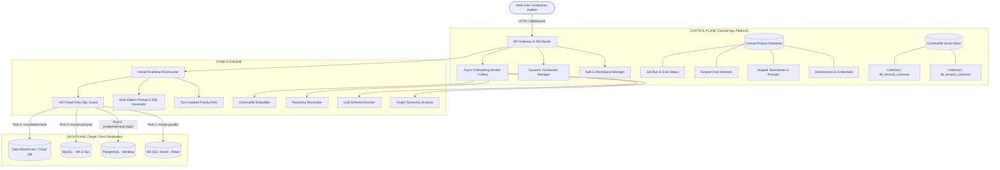
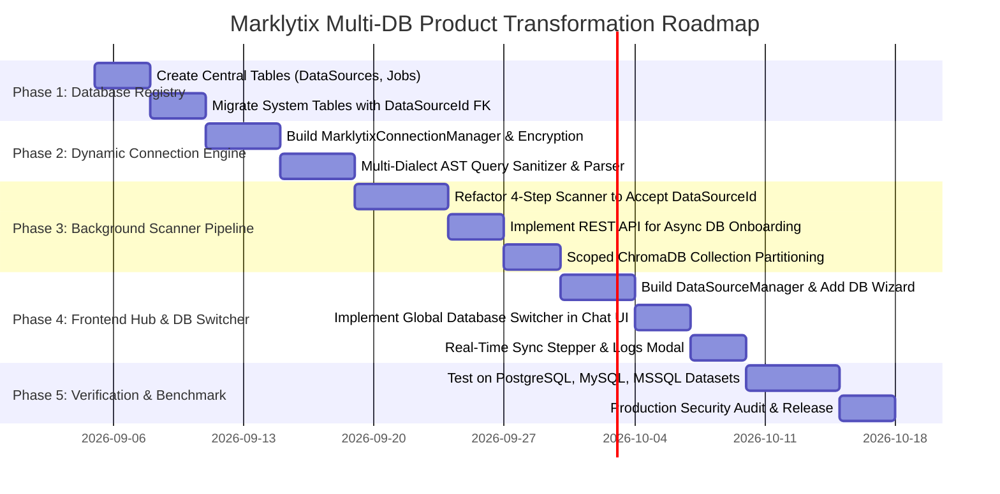

# Marklytix AI: Multi-Database Product Transformation Specification
## Comprehensive Architectural Blueprint for Multi-Database, Multi-Tenant Text-to-SQL Intelligence Platform

---

## 1. Executive Summary & Product Vision

### 1.1 Objective
Transform the **Marklytix AI Chatbot** from a single-database embedded module (tied to a single instance via `.env` configuration) into a **Multi-Database, Multi-Tenant Enterprise AI Product** (Sonata Sarthi / Marklytix Enterprise).

### 1.2 Core Value Proposition
- **Zero-Code Database Onboarding**: Connect any raw relational database (PostgreSQL, MySQL, Microsoft SQL Server, Oracle, Snowflake).
- **Automated AI Indexing Pipeline**: Automatically extract relationships via **Louvain Graph Clustering**, generate business data dictionaries via LLM schema enrichment, construct domain taxonomies, and build persistent vector indexes.
- **Dynamic Multi-Dialect SQL Generation**: Support seamless query generation and execution across diverse SQL dialects (T-SQL, PL/pgSQL, MySQL dialect, etc.).
- **Live Database Switching**: Switch databases in real time in the UI, with isolated chat histories, schema contexts, and vector spaces.
- **Enterprise Security & Read-Only Sandboxing**: AST-level SQL validation, credential encryption at rest, and strict query timeout enforcement.

---

## 2. High-Level Architecture (Current vs. Product State)

### 2.1 Current State (Single Database Architecture)
```
┌─────────────────────────────────────────────────────────────┐
│                    MARKLYTIX CURRENT STATE                  │
│                                                             │
│  .env File (Hardcoded credentials)                          │
│       │                                                     │
│       ▼                                                     │
│  Single MS SQL Database ───────────┐                        │
│    ├─ Business Tables (Data)       │                        │
│    └─ Marklytix System Tables      │ (Metadata in target DB)│
│       ├─ Marklytix_Categories      │                        │
│       ├─ Marklytix_TableDoc        │                        │
│       └─ Marklytix_ChatHistory     │                        │
│       │                                                     │
│  Single Local ChromaDB Collection ─┘                        │
│  Single T-SQL Dialect (TOP N, dbo.[Table])                  │
└─────────────────────────────────────────────────────────────┘
```

### 2.2 Target Product Architecture (Control Plane vs. Data Plane)


---

## 3. Database (DB) Architecture Changes

To support multiple databases, the system metadata tables must be migrated into a **Central Control Database** and linked via foreign keys to a registered **`DataSource`**.

### 3.1 New Core Tables

#### 1. `Marklytix_DataSources` (Connection Registry)
Stores connection parameters and onboarding status for each registered database.

```sql
CREATE TABLE Marklytix_DataSources (
    Id UNIQUEIDENTIFIER PRIMARY KEY DEFAULT NEWID(),
    WorkspaceId VARCHAR(100) NOT NULL,
    Name NVARCHAR(200) NOT NULL,
    Description NVARCHAR(500) NULL,
    DbType VARCHAR(50) NOT NULL, -- 'mssql', 'postgresql', 'mysql', 'oracle', 'snowflake'
    Host NVARCHAR(255) NOT NULL,
    Port INT NOT NULL,
    DatabaseName NVARCHAR(255) NOT NULL,
    Username NVARCHAR(255) NOT NULL,
    EncryptedPassword NVARCHAR(MAX) NOT NULL, -- AES-256 / Fernet encrypted
    Driver NVARCHAR(100) NULL,               -- e.g. 'ODBC Driver 17 for SQL Server'
    SslMode VARCHAR(50) DEFAULT 'prefer',    -- 'disable', 'require', 'verify-ca', 'verify-full'
    SchemaFilter NVARCHAR(500) DEFAULT 'dbo,public', -- Comma-separated schemas to include
    SyncStatus VARCHAR(50) DEFAULT 'NOT_SYNCED', -- 'NOT_SYNCED', 'QUEUED', 'SCANNING', 'ENRICHING', 'RECONCILING', 'EMBEDDING', 'READY', 'FAILED'
    SyncProgress INT DEFAULT 0,              -- 0 to 100 percentage
    SyncErrorMessage NVARCHAR(MAX) NULL,
    TotalTables INT DEFAULT 0,
    TotalColumns INT DEFAULT 0,
    LastScannedAt DATETIME2 NULL,
    IsActive BIT DEFAULT 1,
    CreatedBy VARCHAR(100) NULL,
    CreatedAt DATETIME2 DEFAULT SYSUTCDATETIME(),
    UpdatedAt DATETIME2 DEFAULT SYSUTCDATETIME()
);
```

#### 2. `Marklytix_IndexingJobs` (Pipeline Tracking)
Tracks execution logs and history of scanning jobs per database.

```sql
CREATE TABLE Marklytix_IndexingJobs (
    Id UNIQUEIDENTIFIER PRIMARY KEY DEFAULT NEWID(),
    DataSourceId UNIQUEIDENTIFIER NOT NULL FOREIGN KEY REFERENCES Marklytix_DataSources(Id) ON DELETE CASCADE,
    StepName VARCHAR(100) NOT NULL, -- 'GRAPH_SCAN', 'SCHEMA_ENRICHMENT', 'RECONCILIATION', 'CHROMA_EMBEDDING'
    Status VARCHAR(50) NOT NULL,    -- 'IN_PROGRESS', 'COMPLETED', 'FAILED'
    ProgressPercent INT DEFAULT 0,
    ExecutionLogs NVARCHAR(MAX) NULL,
    StartedAt DATETIME2 DEFAULT SYSUTCDATETIME(),
    FinishedAt DATETIME2 NULL
);
```

---

### 3.2 Migrated System Tables (Scoped by `DataSourceId`)

Every system metadata table gets a `DataSourceId` column:

#### 1. `Marklytix_TableDocumentation`
```sql
CREATE TABLE Marklytix_TableDocumentation (
    Id BIGINT IDENTITY(1,1) PRIMARY KEY,
    DataSourceId UNIQUEIDENTIFIER NOT NULL FOREIGN KEY REFERENCES Marklytix_DataSources(Id) ON DELETE CASCADE,
    TableName NVARCHAR(255) NOT NULL,
    TableSchema NVARCHAR(100) DEFAULT 'dbo',
    TablePurpose NVARCHAR(MAX) NULL,
    ColumnMeanings NVARCHAR(MAX) NULL,     -- JSON: {"col1": "definition", ...}
    ConnectedTables NVARCHAR(MAX) NULL,    -- JSON Array: ["dbo.table2.id = dbo.table1.fk_id"]
    LouvainClusterId INT NULL,
    TotalRows BIGINT DEFAULT 0,
    DataSize_MB FLOAT DEFAULT 0.0,
    PriorityScore FLOAT DEFAULT 0.5,       -- Calculated vitality score [0.01 - 1.00]
    IsActive BIT DEFAULT 1,
    LastEnrichedAt DATETIME2 DEFAULT SYSUTCDATETIME(),
    CONSTRAINT UQ_DataSource_Table UNIQUE (DataSourceId, TableSchema, TableName)
);
```

#### 2. `Marklytix_Categories` & `Marklytix_Subcategories`
```sql
CREATE TABLE Marklytix_Categories (
    Id BIGINT IDENTITY(1,1) PRIMARY KEY,
    DataSourceId UNIQUEIDENTIFIER NOT NULL FOREIGN KEY REFERENCES Marklytix_DataSources(Id) ON DELETE CASCADE,
    CategoryName NVARCHAR(200) NOT NULL,
    Keywords NVARCHAR(MAX) NULL,
    Description NVARCHAR(MAX) NULL,
    IsActive BIT DEFAULT 1,
    CreatedAt DATETIME2 DEFAULT SYSUTCDATETIME(),
    UpdatedAt DATETIME2 DEFAULT SYSUTCDATETIME(),
    CONSTRAINT UQ_DataSource_Category UNIQUE (DataSourceId, CategoryName)
);

CREATE TABLE Marklytix_Subcategories (
    Id BIGINT IDENTITY(1,1) PRIMARY KEY,
    DataSourceId UNIQUEIDENTIFIER NOT NULL FOREIGN KEY REFERENCES Marklytix_DataSources(Id) ON DELETE CASCADE,
    CategoryName NVARCHAR(200) NOT NULL,
    SubcategoryName NVARCHAR(200) NOT NULL,
    Keywords NVARCHAR(MAX) NULL,
    Description NVARCHAR(MAX) NULL,
    IsActive BIT DEFAULT 1,
    CreatedAt DATETIME2 DEFAULT SYSUTCDATETIME(),
    UpdatedAt DATETIME2 DEFAULT SYSUTCDATETIME(),
    CONSTRAINT UQ_DataSource_Subcategory UNIQUE (DataSourceId, CategoryName, SubcategoryName)
);
```

#### 3. `Marklytix_SubcategoryPrompts`
```sql
CREATE TABLE Marklytix_SubcategoryPrompts (
    Id BIGINT IDENTITY(1,1) PRIMARY KEY,
    DataSourceId UNIQUEIDENTIFIER NOT NULL FOREIGN KEY REFERENCES Marklytix_DataSources(Id) ON DELETE CASCADE,
    Category NVARCHAR(200) NOT NULL,
    Subcategory NVARCHAR(200) NOT NULL,
    TableList NVARCHAR(MAX) NULL,
    PromptContent NVARCHAR(MAX) NULL,
    QueryPatterns NVARCHAR(MAX) NULL,
    IsActive BIT DEFAULT 1,
    CreatedAt DATETIME2 DEFAULT SYSUTCDATETIME(),
    UpdatedAt DATETIME2 DEFAULT SYSUTCDATETIME(),
    CONSTRAINT UQ_DataSource_Prompt UNIQUE (DataSourceId, Category, Subcategory)
);
```

#### 4. `Marklytix_ChatHistory`
```sql
CREATE TABLE Marklytix_ChatHistory (
    Id BIGINT IDENTITY(1,1) PRIMARY KEY,
    DataSourceId UNIQUEIDENTIFIER NOT NULL FOREIGN KEY REFERENCES Marklytix_DataSources(Id) ON DELETE CASCADE,
    ChatId INT NOT NULL,
    UserId INT NOT NULL,
    Username NVARCHAR(200) NOT NULL,
    Sender VARCHAR(20) NOT NULL,
    Question NVARCHAR(MAX) NULL,
    GeneratedQuery NVARCHAR(MAX) NULL,
    ResultGenerated NVARCHAR(MAX) NULL,
    ResponseTable NVARCHAR(MAX) NULL,
    QueryCreationTime FLOAT NULL,
    QueryExecutionTime FLOAT NULL,
    CreatedAt DATETIME2 DEFAULT SYSUTCDATETIME()
);
```

---

## 4. Backend Code Changes

### 4.1 Dynamic Connection Manager (`connection_manager.py`)
Replaces hardcoded `os.environ` connection string with a thread-safe connection pooling service.

```python
import os
from cryptography.fernet import Fernet
from sqlalchemy import create_engine
from urllib.parse import quote_plus
from .models import MarklytixDataSources

class MarklytixConnectionManager:
    """Manages cached SQLAlchemy engine instances for multiple target databases."""
    
    _engines = {}
    _fernet = Fernet(os.getenv("ENCRYPTION_KEY", Fernet.generate_key()))

    @classmethod
    def encrypt_password(cls, raw_pwd: str) -> str:
        return cls._fernet.encrypt(raw_pwd.encode()).decode()

    @classmethod
    def decrypt_password(cls, encrypted_pwd: str) -> str:
        return cls._fernet.decrypt(encrypted_pwd.encode()).decode()

    @classmethod
    def get_engine(cls, datasource_id: str):
        if datasource_id in cls._engines:
            return cls._engines[datasource_id]

        ds = MarklytixDataSources.objects.get(id=datasource_id, is_active=True)
        password = cls.decrypt_password(ds.encrypted_password)

        if ds.db_type == "mssql":
            driver = ds.driver or "ODBC Driver 17 for SQL Server"
            conn_str = (
                f"mssql+pyodbc://{ds.username}:{quote_plus(password)}@{ds.host}:{ds.port}/{ds.database_name}"
                f"?driver={driver.replace(' ', '+')}"
            )
        elif ds.db_type == "postgresql":
            conn_str = f"postgresql+psycopg2://{ds.username}:{quote_plus(password)}@{ds.host}:{ds.port}/{ds.database_name}"
        elif ds.db_type == "mysql":
            conn_str = f"mysql+pymysql://{ds.username}:{quote_plus(password)}@{ds.host}:{ds.port}/{ds.database_name}"
        elif ds.db_type == "snowflake":
            conn_str = f"snowflake://{ds.username}:{quote_plus(password)}@{ds.host}/{ds.database_name}"
        else:
            raise ValueError(f"Unsupported database dialect: {ds.db_type}")

        engine = create_engine(
            conn_str,
            pool_size=5,
            max_overflow=10,
            pool_recycle=300,
            pool_pre_ping=True
        )
        cls._engines[datasource_id] = engine
        return engine
```

---

### 4.2 Multi-Dialect SQL Generator & Sanitizer

#### 1. Dialect Rules Matrix
| Dialect | Table / Column Escaping | Pagination Syntax | System Catalogs | Cast Function |
| :--- | :--- | :--- | :--- | :--- |
| **MS SQL Server** | `[schema].[table]` | `SELECT TOP N ...` | `INFORMATION_SCHEMA`, `sys.tables` | `CAST(col AS VARCHAR)` |
| **PostgreSQL** | `"schema"."table"` | `SELECT ... LIMIT N` | `information_schema`, `pg_catalog` | `CAST(col AS TEXT)` or `col::text` |
| **MySQL** | `` `table` `` | `SELECT ... LIMIT N` | `information_schema.tables` | `CAST(col AS CHAR)` |
| **Oracle** | `"SCHEMA"."TABLE"` | `FETCH FIRST N ROWS ONLY` | `ALL_TABLES`, `ALL_TAB_COLUMNS` | `TO_CHAR(col)` |

#### 2. Dialect Adapters in `HierarchicalSearchConsumer`
```python
def format_dialect_sql(sql_query: str, db_type: str) -> str:
    """Sanitizes and enforces dialect-compliant formatting."""
    if db_type == "mssql":
        return ensure_square_bracketed_tables(sql_query)
    elif db_type == "postgresql":
        return ensure_double_quoted_tables(sql_query)
    elif db_type == "mysql":
        return ensure_backtick_tables(sql_query)
    return sql_query
```

#### 3. Strict AST Read-Only Query Validator
```python
import sqlglot
from sqlglot.expressions import Select, Union

def validate_readonly_query(sql_query: str, dialect: str = "tsql") -> bool:
    """Verifies using AST parser that query is strictly read-only."""
    try:
        parsed_expressions = sqlglot.parse(sql_query, read=dialect)
        for expr in parsed_expressions:
            if not isinstance(expr, (Select, Union)):
                return False
        # Block dangerous keywords
        forbidden = ["DROP", "DELETE", "INSERT", "UPDATE", "ALTER", "TRUNCATE", "EXEC", "GRANT", "REVOKE"]
        upper_q = sql_query.upper()
        if any(f" {kw} " in f" {upper_q} " for kw in forbidden):
            return False
        return True
    except Exception:
        return False
```

---

### 4.3 Scoped ChromaDB Vector Store Partitioning

#### Collection Partitioning Pattern
ChromaDB collections are partitioned per `datasource_id`:
- `schemas_{datasource_id}`
- `categories_{datasource_id}`
- `subcategories_{datasource_id}`

```python
def get_chroma_collection(datasource_id: str, collection_type: str):
    """Returns isolated ChromaDB collection for the given datasource."""
    client = chromadb.PersistentClient(path=os.path.join(settings.BASE_DIR, "scratch", "chroma_db_storage"))
    collection_name = f"{collection_type}_{str(datasource_id).replace('-', '_')}"
    return client.get_or_create_collection(
        name=collection_name,
        embedding_function=embedding_functions.DefaultEmbeddingFunction()
    )
```

---

### 4.4 Automated Onboarding Pipeline (Async Runner)

```python
# REST API Endpoint: POST /api/datasources/<datasource_id>/sync/
def trigger_database_sync(request, datasource_id):
    """
    Executes the 4-step onboarding pipeline asynchronously:
    Step 1: Graph Taxonomy Scanner (Louvain Clustering)
    Step 2: Table Schema Enricher (LLM Data Dictionary)
    Step 3: Reconciler Service (Domain Prompts & Categories)
    Step 4: ChromaDB Refresh & Priority Score Embedder
    """
    job = MarklytixIndexingJobs.objects.create(
        datasource_id=datasource_id,
        step_name="FULL_ONBOARDING",
        status="IN_PROGRESS"
    )
    
    # Run in background worker / thread
    threading.Thread(target=run_pipeline_worker, args=(datasource_id, job.id)).start()
    return JsonResponse({"status": "SUCCESS", "job_id": str(job.id)})
```

---

### 4.5 WebSocket Multi-DB Protocol (`consumers.py`)

Client sends the active `datasource_id` during initial handshake:
```json
{
  "action": "init_session",
  "datasource_id": "a3c457f9-81bc-4e2a-9214-41d392cf931b",
  "branch_id": "101"
}
```

The consumer loads the corresponding:
1. SQLAlchemy connection pool (`MarklytixConnectionManager.get_engine(datasource_id)`)
2. Vector collection (`schemas_{datasource_id}`)
3. Domain prompts (`MarklytixSubcategoryPrompts.objects.filter(datasource_id=datasource_id)`)
4. Dialect formatting rules (`db_type = 'postgresql'`)

---

## 5. Frontend Code Changes (UI / UX)

### 5.1 New Frontend Modules & Pages

```
sonata_satark_fe/satark/src/pages/marklytix/
├── pages/
│   ├── DataSourceManager.jsx          [NEW: DB Connection Hub & Sync Status]
│   ├── SchemaExplorerPage.jsx         [NEW: Discovered Tables & Data Dictionary]
│   ├── HierarchicalSearchPage.jsx     [MODIFY: Add Database Selector Dropdown]
│   └── MainHistoryPage.jsx            [MODIFY: Filter history by active DB]
└── components/
    ├── AddDataSourceModal.jsx         [NEW: Wizard to test & connect new DB]
    ├── DatabaseSwitcher.jsx           [NEW: Header dropdown for active DB]
    └── SyncProgressModal.jsx          [NEW: Real-time 4-step scanner stepper]
```

### 5.2 UI Mockups & User Workflows

#### 1. Header Database Switcher (`DatabaseSwitcher.jsx`)
```
┌─────────────────────────────────────────────────────────────────────────────────┐
│ 🔍 Marklytix AI    [ Active DB: 🏦 Core Banking (Postgres) ▾ ]   [ ⚙ Manage DBs ]│
└─────────────────────────────────────────────────────────────────────────────────┘
```
- Changing the active database dynamically updates the prompt context, table schema suggestions, and chat session.

#### 2. Database Manager Hub (`DataSourceManager.jsx`)
- Displays grid of connected databases:
  - **Database Card**: Name, Type (`PostgreSQL`, `MSSQL`), Host, Total Tables, Sync Status (`READY`, `SYNCING 65%`, `ERROR`).
  - **Action Buttons**: `Test Connection`, `Re-index / Scan DB`, `Explore Schema`, `Delete`.

#### 3. Real-time Onboarding Stepper (`SyncProgressModal.jsx`)
```
Step 1: Graph Taxonomy Discovery (Louvain Communities)       [ ✔ Completed (12 clusters) ]
Step 2: LLM Schema Enrichment (Data Dictionary & JOINs)     [ 🔄 Running (45/68 tables)  ]
Step 3: Taxonomy & Domain Prompt Reconciliation              [ ⏳ Pending                ]
Step 4: Priority Scoring & ChromaDB Vector Embeddings        [ ⏳ Pending                ]
```

---

## 6. Testing & Validation Across Different Databases

### 6.1 Supported Database Matrix
| Database Engine | Minimum Version | Required Python Driver | Supported Features |
| :--- | :--- | :--- | :--- |
| **Microsoft SQL Server** | 2016+ / Azure SQL | `pyodbc` | Full (Louvain, Views, Stored Procs, Priority Scoring) |
| **PostgreSQL** | 12+ / Supabase / RDS | `psycopg2-binary` | Full (`information_schema`, Foreign Keys, Partition stats) |
| **MySQL / MariaDB** | 8.0+ / 10.5+ | `pymysql` | Full (`information_schema.KEY_COLUMN_USAGE`) |
| **Oracle Database** | 19c+ | `cx_Oracle` / `oracledb` | Standard Queries & Schemas |
| **Snowflake** | Cloud Data Cloud | `snowflake-sqlalchemy` | Large scale analytical tables |

### 6.2 Standard Benchmark Testing Protocol

To verify accuracy across databases:
1. **Load Standard Datasets**:
   - `Northwind` (MSSQL, PostgreSQL, MySQL versions)
   - `Pagila / Sakila` (Rental & Customer Management)
   - `Enterprise Banking / Audit Schema` (Sonata Satark production schema)
2. **Execute 100 Standard Benchmark Queries** covering:
   - Simple Filtering (`WHERE`, `IN`, `BETWEEN`)
   - Complex Multi-Table Aggregations (`JOIN`, `GROUP BY`, `HAVING`)
   - Window Functions (`ROW_NUMBER() OVER (PARTITION BY ...)`)
   - Temporal Date Arithmetic (`DATEDIFF`, `DATEADD`, `INTERVAL`)
3. **Automated Verification Metric**:
   $$\text{Accuracy Rate} = \frac{\text{Queries producing identical result set as Gold Standard SQL}}{\text{Total 100 Test Queries}} \times 100\%$$

---

## 7. Security, Sandboxing & Enterprise Readiness

1. **Credential Protection**:
   - Database passwords are encrypted at rest using AES-256 (Fernet cipher).
   - Passwords are never sent back to the frontend API responses (masked as `••••••••`).
2. **Read-Only Database Permissions**:
   - Advise customers to supply dedicated database users with `GRANT SELECT ON SCHEMA ...` only.
3. **Execution Timeouts**:
   - Hard execution timeout of 15 seconds per SQL query to prevent accidental long-running table locks.
4. **Row-Limit Enforcers**:
   - Automatically inject limiters (e.g. `TOP 100` or `LIMIT 100`) if the generated SQL query does not contain pagination.

---

## 8. Step-by-Step Implementation Roadmap



---

## 9. Conclusion

By separating the **Control Plane** (central connection registry, scoped metadata, partitioned vector collections) from the **Data Plane** (dynamic multi-dialect connection pools), Marklytix transforms into a plug-and-play AI data intelligence product capable of analyzing and querying any relational database in enterprise environments.
