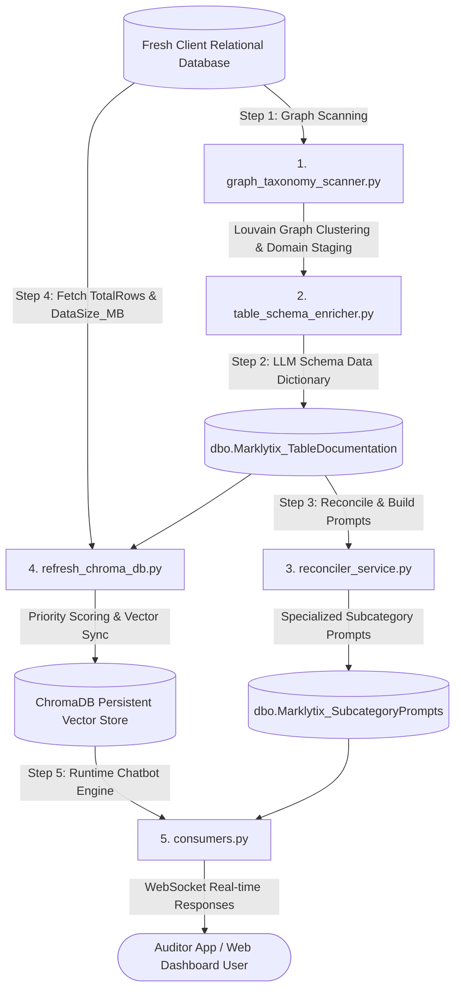

# Enterprise Architecture Blueprint: New Database Onboarding & Complete Chatbot Setup
## Zero-to-Hero Production Deployment Guide for Marklytix AI Chatbot Engine

---

## 1. Executive Summary

The **Marklytix AI Chatbot Engine** is a self-configuring, multi-agent natural language database intelligence system. It is designed to take **ANY raw, un-documented relational database** (SQL Server, PostgreSQL, MySQL) and automatically:
1. Extract relationship graphs and discover domain communities via **Louvain Graph Clustering**.
2. Auto-generate business purpose descriptions, data dictionaries, and explicit JOIN keys using LLM Schema Enrichment.
3. Construct domain taxonomy (`Categories` and `Subcategories`) and specialized domain system prompts.
4. Calculate **Production Priority & Vitality Scores** ($PriorityScore$) to filter out legacy backup (`_bkp`) and empty `temp` tables.
5. Deploy a sub-second, multi-agent WebSocket runtime engine (`HierarchicalSearchConsumer`).

---

## 2. The 5 Core Product Modules



| Module Name | File Location | Responsibility | Execution Stage |
| :--- | :--- | :--- | :--- |
| **Graph Taxonomy Scanner** | [`graph_taxonomy_scanner.py`](file:///c:/sonata%20satark/sonata_satark_be/satark/Marklytix/db_scanner/graph_taxonomy_scanner.py) | Analyzes Foreign Keys, shared Primary Keys, and TF-IDF column similarity graph. Runs Louvain Clustering and LLM domain naming. | **Step 1: Setup Phase** |
| **Table Schema Enricher** | [`table_schema_enricher.py`](file:///c:/sonata%20satark/sonata_satark_be/satark/Marklytix/db_scanner/table_schema_enricher.py) | Reads `INFORMATION_SCHEMA.COLUMNS` and invokes LLM to generate business purposes, column data dictionaries, and explicit JOIN links. | **Step 2: Setup Phase** |
| **Reconciler Service** | [`reconciler_service.py`](file:///c:/sonata%20satark/sonata_satark_be/satark/Marklytix/db_scanner/reconciler_service.py) | Reconciles staging records into production taxonomy tables. Detects schema updates and creates specialized domain prompts. | **Step 3: Setup Phase** |
| **ChromaDB Refresh Engine** | [`refresh_chroma_db.py`](file:///c:/sonata%20satark/sonata_satark_be/satark/Marklytix/db_scanner/refresh_chroma_db.py) | Queries SQL Server statistics (`sys.partitions`), computes logarithmic $PriorityScore$, and syncs vector collections to disk. | **Step 4: Setup Phase** |
| **Runtime WebSocket Consumer** | [`consumers.py`](file:///c:/sonata%20satark/sonata_satark_be/satark/Marklytix/consumers.py) | Operates 5-level multi-agent runtime: Turn Context Stripping, Priority RAG Ranking, T-SQL Generation, SQL Execution, Response Synthesis. | **Step 5: Production Runtime** |

---

## 3. Step-by-Step New Database Onboarding Guide

To onboard a completely new database, follow these 5 automated CLI commands:

### Step 1: Run Graph Taxonomy Scanner
```bash
python -m db_scanner.graph_taxonomy_scanner
```
- **What it does**: Inspects foreign keys and primary keys across all tables. Builds an undirected network graph, runs Louvain Community Detection to cluster related tables into logical modules, and calls Gemma LLM to assign human-readable Domain Names (e.g. `Domain 1: User Interaction & Access Controls`) and Subcategories.
- **Output**: Populates `dbo.Marklytix_Staging_Categories` and `dbo.Marklytix_Staging_Subcategories`.

### Step 2: Run Table Schema Enricher
```bash
python -m db_scanner.table_schema_enricher
```
- **What it does**: Iterates through all database tables, reads column definitions from `INFORMATION_SCHEMA.COLUMNS`, and invokes the LLM to generate:
  - `TablePurpose`: High-level operational purpose of the table.
  - `ColumnMeanings`: JSON data dictionary mapping every column to its business definition.
  - `ConnectedTables`: Array of explicit JOIN predicates (`dbo.table1.[col] = dbo.table2.[col]`).
  - `LouvainClusterId`: Graph community cluster ID.
- **Output**: Populates `dbo.Marklytix_TableDocumentation`.

### Step 3: Run Reconciler Service
```bash
python -m db_scanner.reconciler_service
```
- **What it does**: Reads staging tables and reconciles them into production taxonomy tables (`Marklytix_Categories`, `Marklytix_Subcategories`). Deduplicates keywords, constructs join relationships, and creates specialized domain system prompts containing exact T-SQL rules and available table lists for each subcategory.
- **Output**: Populates `dbo.Marklytix_SubcategoryPrompts`.

### Step 4: Run ChromaDB Refresh & Priority Scoring Engine
```bash
python -m db_scanner.refresh_chroma_db
```
- **What it does**: Queries SQL Server system views (`sys.partitions`, `sys.allocation_units`) to fetch real-time row counts (`TotalRows`) and sizes (`DataSize_MB`). Computes the **Production Priority Score ($PriorityScore \in [0.01, 1.00]$)**:
  $$\text{BaseScore} = (0.50 \cdot S_{volume}) + (0.30 \cdot S_{storage}) + Penalty + Bonus_{active}$$
  Embeds enriched table schema documents, category vectors, and subcategory vectors into persistent disk storage (`scratch/chroma_db_storage`).
- **Output**: Generates persistent ChromaDB HNSW collections: `marklytix_table_schemas`, `marklytix_categories`, `marklytix_subcategories`.

### Step 5: Start Runtime WebSocket Server
```bash
python manage.py runserver 0.0.0.0:8000
```
- **What it does**: The chatbot product is now **100% ready for production**! Frontend clients connect via WebSocket (`ws://host/ws/hierarchical-search/`) with session-bound `branch_id`.

---

## 4. Generated System Infrastructure Tables

When onboarding a new database, the scanner automatically manages these 6 system metadata tables:

1. **`dbo.Marklytix_TableDocumentation`**: Central documentation repository containing AI-generated business purposes, data dictionaries, explicit JOIN predicates, and Louvain cluster IDs.
2. **`dbo.Marklytix_SubcategoryPrompts`**: Production prompts table storing specialized domain T-SQL rules and table lists for each subcategory.
3. **`dbo.Marklytix_Categories`**: Production category taxonomy mapping high-level operational domains.
4. **`dbo.Marklytix_Subcategories`**: Production subcategory taxonomy mapping targeted sub-domains with deduplicated search keywords.
5. **`dbo.Marklytix_Staging_Categories`**: Staging area where `graph_taxonomy_scanner.py` inserts newly discovered candidate categories.
6. **`dbo.Marklytix_Staging_Subcategories`**: Staging area for candidate subcategories prior to reconciliation.

---

## 5. Runtime Multi-Agent Execution Protocol ([`consumers.py`](file:///c:/sonata%20satark/sonata_satark_be/satark/Marklytix/consumers.py))

At runtime, when an auditor or web user sends a question, `HierarchicalSearchConsumer` executes a 5-level multi-agent pipeline:

1. **Level 0 (Turn-Isolated Priority RAG)**: Strips previous chat history before calling ChromaDB vector search (`clean_query = message.split("Current question:")[-1]`). RAG ranks schemas using $\text{Combined Rank} = 0.70 \cdot \text{Vector Sim} + 0.30 \cdot \text{PriorityScore}$, placing active production tables at the top and filtering out backup (`_bkp`) and empty temp tables.
2. **Level 1 (Category Classification)**: Direct Table Schema Match Overrider checks if exact table/column names are in prompt; otherwise routes via keyword match and category vector similarity.
3. **Level 2 (Subcategory Router)**: Performs restricted vector lookup (`where parent_category = X`) with auto-reconnecting collection fallback.
4. **Level 3 (Specialized T-SQL Generation)**: Injects domain system prompt and streamlined table schemas (~850 tokens). Enforces bracketed syntax `dbo.[table]`, T-SQL `TOP N`, and streams live prompt logs over WebSocket.
5. **Level 4 (Execution & Synthesis)**: Executes query against SQL Server via read-only ODBC driver, builds HTML data table preview, and synthesizes executive narrative report.
